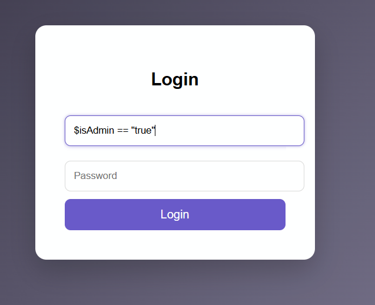
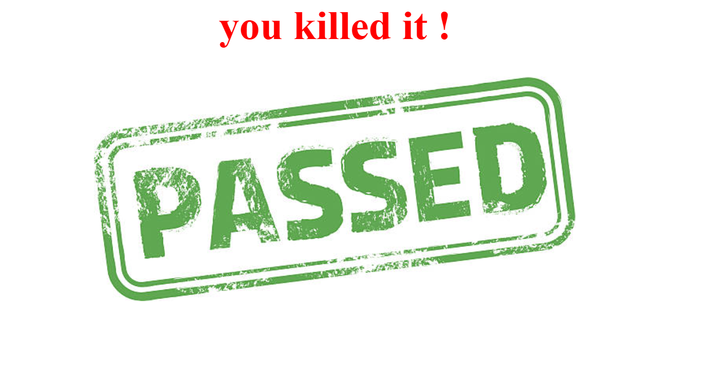

<br/>

<p align="center">
  
  
  
  
</p>

<h1 align="center">🔓 Broken Access Control</h1>
<h3 align="center">Parameter Tampering & Privilege Escalation — Educational Demo</h3>

<p align="center">
  
</p>

---

## 📌 Description

This project demonstrates a **Broken Access Control** vulnerability that arises when a server blindly trusts user-controlled input for authorization decisions.

The backend checks the `isAdmin` value from a **POST request** — a parameter that is fully controlled by the attacker — and grants admin privileges accordingly. No valid credentials are needed.

> **OWASP Category:** A01:2021 – Broken Access Control

---

## 🚨 Vulnerability Type

| # | Type |
|---|------|
| 1 | 🔀 Parameter Tampering |
| 2 | ⬆️ Privilege Escalation |
| 3 | 🔓 Broken Access Control |

---

## 🛠 How It Works

The vulnerable server logic trusts a POST parameter to decide if a user is an admin:

```php
// ❌ VULNERABLE — Client controls their own privilege level
$isAdmin = $_POST['isAdmin'];

if ($isAdmin == "true") {
    echo "200"; // Admin access granted
}
```

Since an attacker controls every byte of their own POST request, they simply send:

```http
POST /login HTTP/1.1
Content-Type: application/x-www-form-urlencoded

username=anything&password=anything&isAdmin=true
```

The server reads `isAdmin=true` and grants full admin access — **no valid password required**.

---

## 🖼 Screenshots

<p align="center">
  
  &nbsp;&nbsp;
  
</p>

---

## 🔐 Root Cause

> The application **trusts the client** to declare its own permission level.

This is fundamentally wrong. The client is an attacker. The server must never ask the attacker whether they are an admin.

```
❌  if ($_POST['isAdmin'] == "true")     → Trusts the attacker
✅  if ($session->getRole() == "admin")  → Trusts the server
```

**Never trust these sources for authorization:**
- `$_POST` / `$_GET` parameters
- Hidden HTML form fields
- Client-set cookies without server-side validation
- `localStorage` / `sessionStorage`
- Any HTTP header the client can modify

**Always rely on:**
- Server-side session data (`$_SESSION`)
- Database roles fetched after authentication
- Verified & signed tokens (JWT with secret key)

---

## 🛡 Secure Fix

```php
// ✅ SECURE — Role fetched from the database, not from the user
session_start();

if (empty($_SESSION['user_id'])) {
    http_response_code(401);
    exit("Unauthorized: Please log in.");
}

$stmt = $pdo->prepare("SELECT role FROM users WHERE id = ?");
$stmt->execute([$_SESSION['user_id']]);
$user = $stmt->fetch();

if ($user['role'] !== 'admin') {
    http_response_code(403);
    exit("Forbidden: Admins only.");
}

echo "Welcome, Admin!";
```

---

## 📚 References

- 🔗 [OWASP A01:2021 – Broken Access Control](https://owasp.org/Top10/A01_2021-Broken_Access_Control/)
- 🔗 [OWASP Access Control Cheat Sheet](https://cheatsheetseries.owasp.org/cheatsheets/Access_Control_Cheat_Sheet.html)
- 🔗 [PortSwigger – Access Control Labs](https://portswigger.net/web-security/access-control)

---

## ⚠️ Disclaimer

> This repository is for **educational and research purposes only**.  
> Do not use these techniques on systems you do not own or have explicit written permission to test.  
> Practice responsibly in legal environments such as [DVWA](https://github.com/digininja/DVWA), [HackTheBox](https://www.hackthebox.com/), or [TryHackMe](https://tryhackme.com/).

---

<p align="center">
  Made with 🖤 for the Security Community &nbsp;|&nbsp; <strong>Happy Hacking — Ethically!</strong>
</p>